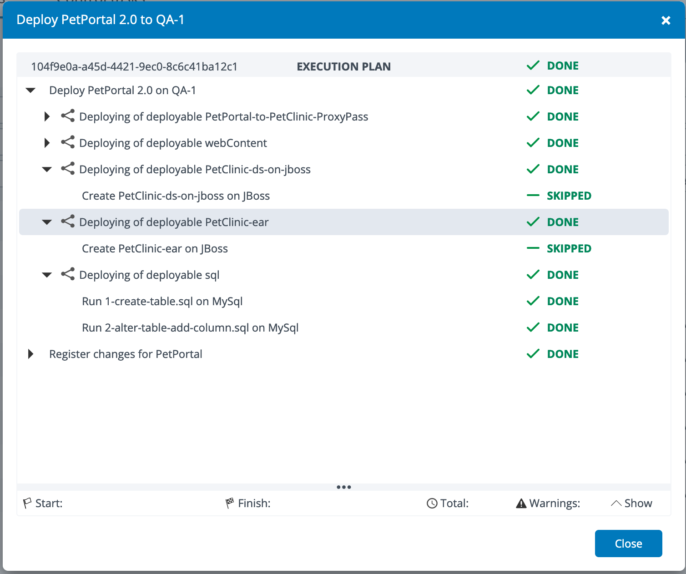

# XL Deploy CLI Plugin #

## Preface

This document describes the functionality provided by the XL Deploy cli AutoSkip plugin.

See the [XL Deploy reference manual](https://docs.xebialabs.com/xl-Deploy) for background information on XL Deploy and release automation concepts.

## Overview

The `xld-AutoSkip-plugin` is an [XL Deploy cli](https://docs.xebialabs.com/v.9.5/xl-deploy) plugin that allows you to start a deployment and skip steps with user created
keywords in the step description.

## Installation

### Building

You can use the gradle wrapper to build the plugin.

```
./gradlew clean assemble

```

### Installing

To install this plugin you need to put the jar file into `XL_DEPLOY_CLI_HOME/plugins` and restart XL Release:

* `xld-AutoSkip-plugin-<version>.jar` (you can find it in `xld-AutoSkip-plugin/build/libs/` once you build it),

Restart the XL Deploy cli after installing the JAR files.

## Usage

### Sample Run to Skip tasks with Jboss in the description
```
from AutoSkip.AutoSkip import AutoSkip
o = AutoSkip()
orc = ['parallel-by-container', 'parallel-by-deployable']
o.start_deployment('Applications/PetPortal/2.0', 'Environments/Dev/QA-1', 'jBOsS',  orc)   
```



## References

### Development
